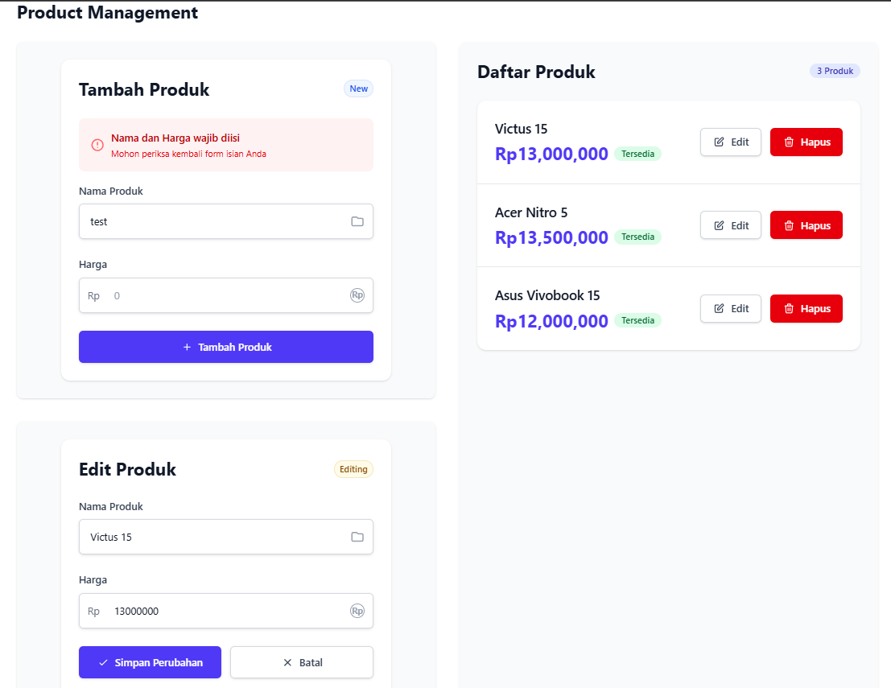
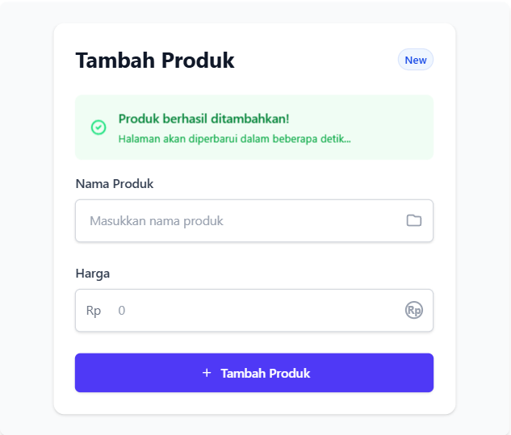
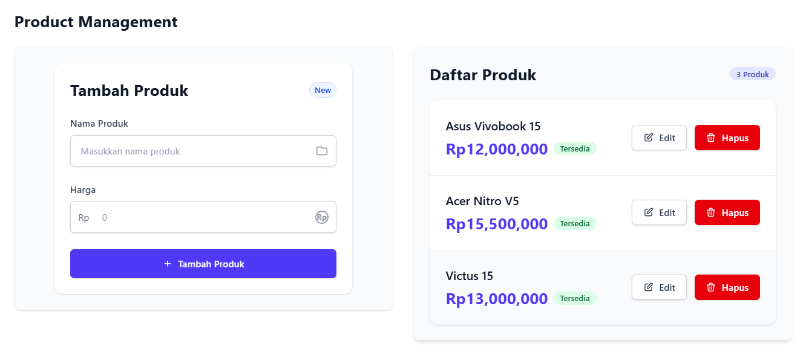
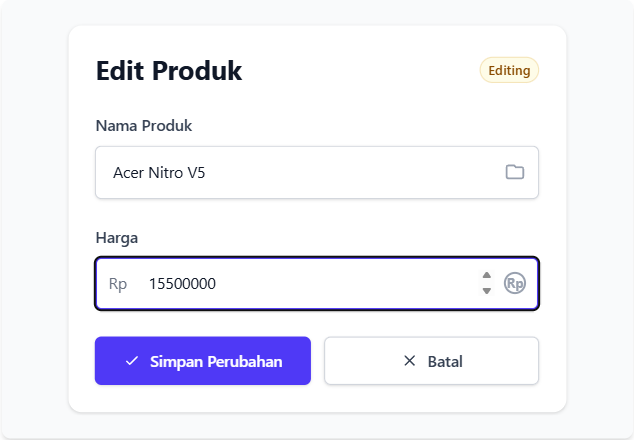
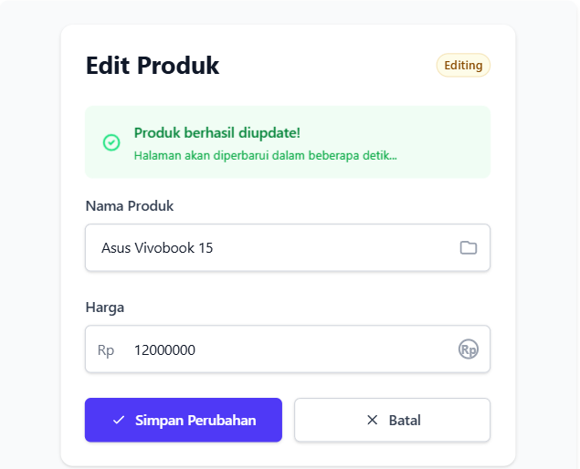
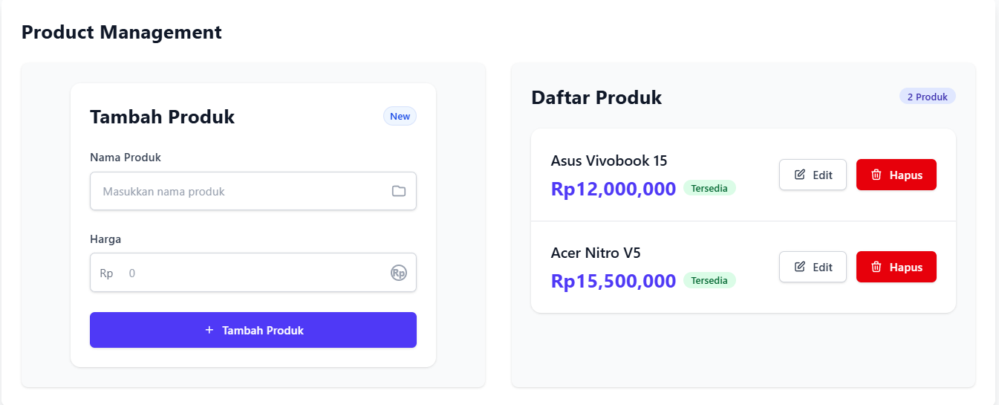
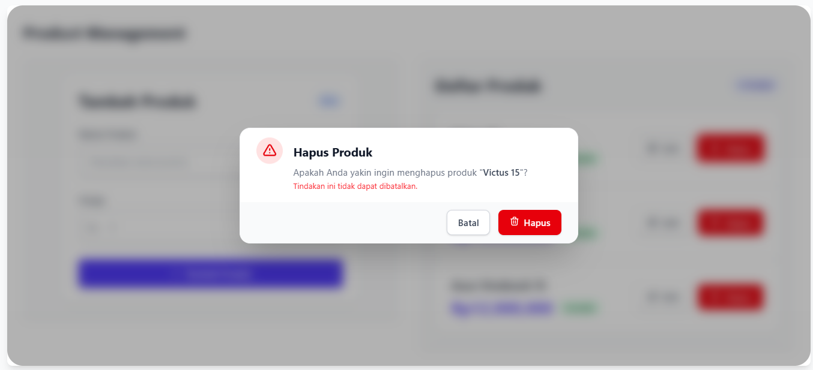
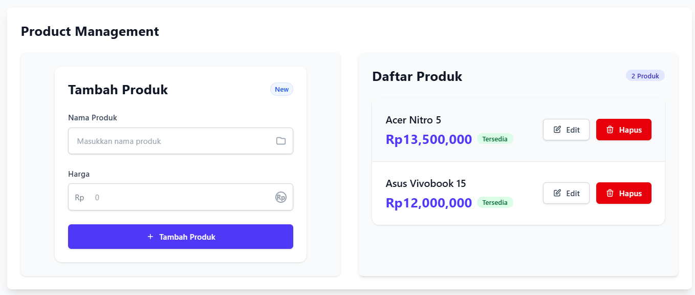
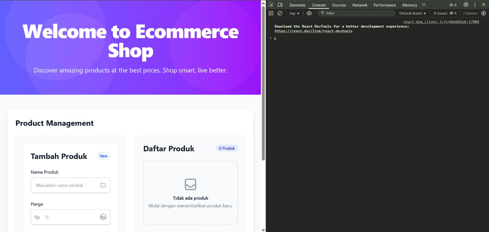
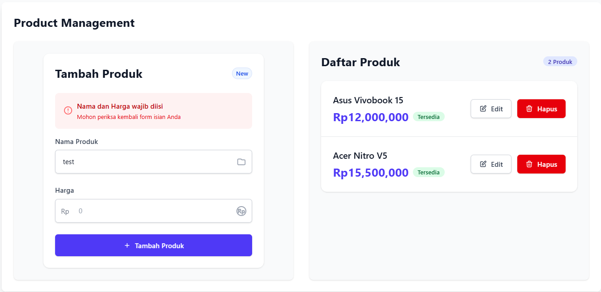

# E-Commerce Product Management System

## Deskripsi Proyek
Aplikasi E-Commerce Product Management System adalah sistem pengelolaan produk berbasis web yang dibangun menggunakan React.js untuk frontend dan Express.js untuk backend. Aplikasi ini menyediakan antarmuka yang modern dan intuitif untuk manajemen produk dalam konteks e-commerce.

## Teknologi yang Digunakan
- Frontend:
  - React.js
  - Tailwind CSS untuk styling
  - Axios untuk HTTP requests
- Backend:
  - Express.js
  - Node.js
  - RESTful API

## Prasyarat
Sebelum menjalankan aplikasi, pastikan telah terinstall:
- Node.js (versi 14.0.0 atau lebih tinggi)
- NPM (Node Package Manager)
- Web browser modern (Chrome, Firefox, Safari, atau Edge)

## Instalasi dan Penggunaan

### Cara Install Dependensi:
```bash
npm install
```

### Cara Menjalankan Aplikasi Backend:
```bash
node index.js
```
Server akan berjalan pada `http://localhost:3001`

### Cara Menjalankan Aplikasi Frontend:
```bash
npm run dev
```
Aplikasi dapat diakses pada `http://localhost:5173` (atau port yang ditentukan)

## Struktur Proyek
```
ecommerce-main/
├── frontend/
│   ├── src/
│   │   ├── components/
│   │   │   ├── ProdukList.jsx
│   │   │   ├── TambahProduk.jsx
│   │   │   └── EditProduk.jsx
│   │   ├── App.jsx
│   │   └── main.jsx
│   └── package.json
└── backend/
    ├── index.js
    └── package.json
```

## API Endpoints

### Base URL: http://localhost:3001

#### 1. Get All Products
- Method: GET
- Endpoint: /produk
- Response: Array of products
- Used in: ProdukList.jsx

#### 2. Get Single Product
- Method: GET 
- Endpoint: /produk/:id
- Parameters: id (number)
- Response: Single product object
- Used in: EditProduk.jsx

#### 3. Create Product
- Method: POST
- Endpoint: /produk
- Body: { nama: string, harga: number }
- Response: Created product object
- Used in: TambahProduk.jsx

<<<<<<< HEAD
#### 4. Update Product
- Method: PATCH
- Endpoint: /produk/:id
- Parameters: id (number)
- Body: { nama: string, harga: number }
- Response: Updated product object
- Used in: EditProduk.jsx

#### 5. Delete Product
- Method: DELETE
- Endpoint: /produk/:id
- Parameters: id (number)
- Response: { message: 'Produk dihapus' }
- Used in: ProdukList.jsx

### Additional Test Endpoints (Unused):
=======
Tetapi, juga terdapat beberapa endpoint API yang tidak digunakan dalam penggunaan aplikasi, seperti :

>>>>>>> 205345318469d69a0cb8a50c7aa988cac01b778e
1. GET /
   - Returns: "Hello World from Express.js!"
2. POST /data
   - Body: { nama: string }
   - Returns: "Data diterima: {nama}"
3. DELETE /data/:id
   - Returns: "Data dengan id {id} telah dihapus"
4. PUT /data/:id
   - Body: { nama: string }
   - Returns: "Data dengan id {id} telah diubah menjadi {nama}"

## Fitur Aplikasi

### 1. Manajemen Produk
- Create: Menambahkan produk baru
- Read: Menampilkan daftar produk
- Update: Mengubah data produk
- Delete: Menghapus produk

### 2. Validasi Input
- Validasi form untuk input produk
- Feedback visual untuk error
- Konfirmasi untuk aksi penting

### 3. User Interface
- Desain responsif
- Animasi dan transisi
- Feedback visual
- Loading states

## Review Aplikasi Berjalan Tanpa Error

Aplikasi E-commerce ini telah berhasil diimplementasikan dengan berbagai fitur modern dan user-friendly. Dalam pengujian yang dilakukan, seluruh fungsionalitas berjalan dengan baik tanpa ditemukan error atau bug yang signifikan. Berikut adalah review detail dari implementasi aplikasi:

### Tampilan dan Interaksi Utama
Aplikasi menyajikan antarmuka yang modern dan intuitif dengan fokus pada pengalaman pengguna yang optimal. Halaman utama menampilkan daftar produk dengan layout yang rapi, dilengkapi dengan informasi yang jelas tentang setiap produk.

**Fitur-fitur Utama:**
1. **Manajemen Produk**
   - Daftar produk dengan tampilan modern
   - Badge penghitung jumlah produk
   - Status ketersediaan produk
   

2. **Sistem CRUD yang Lengkap**
   * Penambahan Produk:
     - Form input yang intuitif
     - Validasi data real-time
     - Feedback visual saat sukses
     
     

   * Pembaruan Produk:
     - Modal edit dengan data terpopulasi
     - Preview perubahan langsung
     - Konfirmasi sukses yang jelas
     
     
     

   * Penghapusan Produk:
     - Modal konfirmasi yang aman
     - Feedback visual yang jelas
     - Update tampilan secara real-time
     
     

### User Experience:
- Desain responsif di berbagai perangkat
- Feedback visual yang informatif
- Navigasi yang mudah dan intuitif
- Pesan error yang jelas dan helpful


### Validasi dan Error Handling

Aplikasi dilengkapi dengan sistem validasi yang komprehensif:
- Pencegahan input kosong dengan pesan error yang jelas
- Animasi 'shake' pada form invalid
- Highlight field yang memerlukan perhatian
- Panduan pengguna yang informatif


### Kesimpulan

Setelah melalui serangkaian pengujian dan perbaikan, aplikasi berhasil terbukti dengan:

1. Berjalan dengan stabil tanpa error
2. Memiliki performa yang optimal
3. Menyajikan UX/UI yang modern dan user-friendly
4. Menangani berbagai kasus penggunaan dengan baik
5. Memberikan feedback yang jelas kepada pengguna

Semua fitur telah berfungsi sesuai dengan spesifikasi yang diharapkan, menciptakan pengalaman pengguna yang mulus dan profesional dalam manajemen produk e-commerce.

## Troubleshooting

### Masalah Umum dan Solusi
1. Jika server tidak bisa dijalankan:
   - Pastikan port 3001 tidak digunakan oleh aplikasi lain
   - Periksa instalasi Node.js dan NPM

2. Jika frontend tidak bisa diakses:
   - Pastikan semua dependensi terinstall dengan `npm install`
   - Periksa console browser untuk error

3. Jika API tidak merespons:
   - Pastikan backend server berjalan
   - Periksa URL dan port yang digunakan
